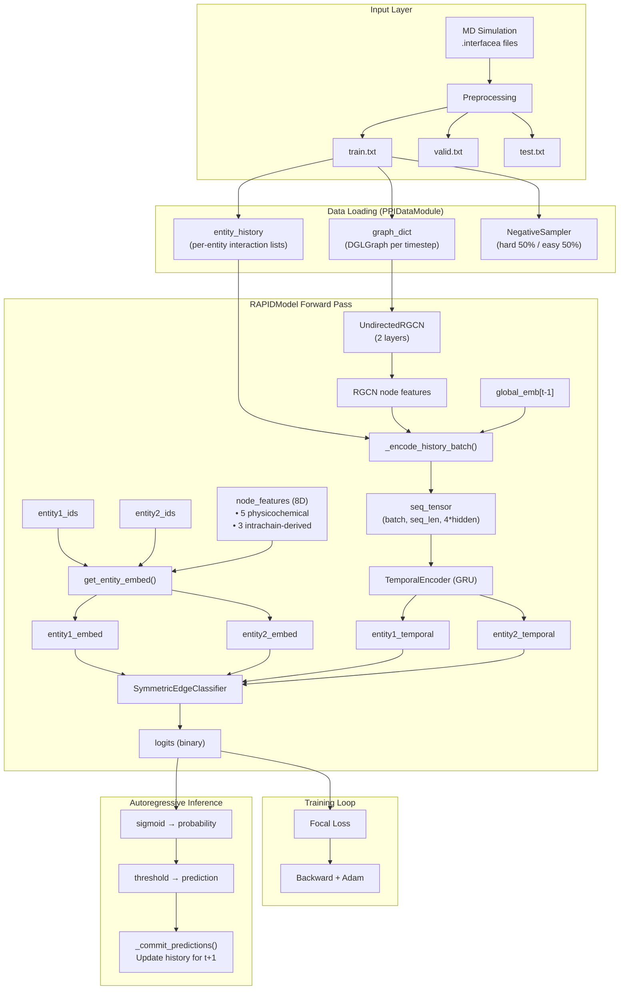

# RAPID Architecture Analysis & Improvement Proposals

## Executive Summary

RAPID (Recurrent Architecture for Predicting Protein Interaction Dynamics) is a deep learning model that predicts whether protein residue pairs will interact at future timesteps. After thorough code analysis **and data-driven experiments**, I've identified key challenges and improvement opportunities.

> [!CAUTION]
> **Critical Finding**: A simple "predict same as yesterday" baseline achieves **87.1% accuracy**. The model must demonstrate significant improvement over this to prove it captures dynamics, not just persistence.

---

## Part 0: Data-Driven Findings (1JPS Dataset)

### Transition Statistics

| Transition Type | Count | Percentage |
|----------------|-------|------------|
| ON→ON (persistence) | 3,836 | 26.27% |
| OFF→OFF (persistence) | 8,880 | 60.82% |
| ON→OFF (breaking) | 942 | 6.45% |
| OFF→ON (forming) | 942 | 6.45% |

**Key Rates**:
- **Persistence rate: 87.1%** (pairs stay in the same state)
- **Transition rate: 12.9%** (pairs change state)
- P(stay ON \| was ON): 80.3%
- P(break \| was ON): 19.7%  
- P(form \| was OFF): 9.6%

### Persistence Patterns

| Metric | ON Runs | OFF Runs |
|--------|---------|----------|
| Mean length | 4.60 timesteps | 7.13 timesteps |
| Median | 2.00 | 2.00 |
| Max | 127 | 182 |

### Signal Analysis for Transition Prediction

| Signal | Effect Size | p-value | Verdict |
|--------|-------------|---------|--------|
| **Entity activity** | Mean 2.01 (forming) vs 1.51 (not forming) | 2.17e-33 | ✅ Significant |
| **Shared neighbors** | 0.0 vs 0.0 | 1.0 | ❌ No signal |

### Baseline Accuracy

| Baseline | Accuracy |
|----------|----------|
| **Persistence (predict t-1 state)** | **87.10%** |
| Always OFF | 67.27% |
| Always ON | 32.73% |
| Random | 50.00% |

> [!IMPORTANT]
> **Implication**: Entity activity level is a **significant predictor** of whether a pair will form. The RGCN should capture this through neighborhood aggregation. However, shared neighbors (direct graph signal) show no predictive power.

---

## Part 1: Architecture Deep Dive

### 1.1 High-Level Data Flow



### 1.2 Component Details

#### A. Entity Embeddings + Node Features
- **Learnable embeddings**: `entity_embeds` of shape `(num_entities, hidden_dim=200)`
- **Static node features** (optional, 8D):
  - 5 physicochemical: hydrophobicity, charge, size, polarity, aromaticity
  - 3 intrachain-derived: mean distance to interface, intrachain degree, interface neighbor fraction
- Combined via: `base_embed + Linear(node_features)`

#### B. RGCN Graph Convolution
- **Purpose**: Learn neighborhood-aware entity representations from interaction graphs
- **Architecture**: 2-layer RGCN with basis decomposition (`num_bases=100`)
- **Input**: Per-timestep graphs from `graph_dict`
- **Output**: Updated node features enriched with local topology

#### C. History Encoding (`_encode_history_batch`)
Each entity's history entry at timestep `t` is encoded as **4 × hidden_dim** vector:
1. **RGCN embedding**: Entity's representation from `graph_dict[t]`
2. **Base entity embedding**: Static learned representation
3. **Mean relation embedding**: Average of all relation types (not neighbor-specific!)
4. **Global embedding**: Graph-level temporal context from `global_emb[t]`

> **Critical Observation**: The history encoding uses the **mean of ALL relation embeddings**, not the actual relations from that timestep. This discards information about the specific types of interactions the entity had.

#### D. Temporal Encoder (GRU)
- Single-layer GRU processing packed sequences
- Takes last `seq_len=10` history entries
- Outputs final hidden state as temporal embedding

#### E. Symmetric Edge Classifier
- MLP: `Linear(4*hidden → 128) → ReLU → Dropout → Linear(128 → 64) → ReLU → Dropout → Linear(64 → 1)`
- **Symmetric scoring**: `(score(e1,e2) + score(e2,e1)) / 2`
- Input: `[entity1_embed, entity2_embed, temporal1, temporal2]`

#### F. Global Model (Optional)
- Separate RGCN + pooling per timestep graph
- GRU encodes sequence of graph-level embeddings
- `global_emb[t]` represents system-wide state using graphs from times < t+1
- **Pretraining objective**: Predict entity distribution at next timestep

### 1.3 Training vs Inference

| Aspect | Training | Inference |
|--------|----------|-----------|
| History source | Oracle (ground truth) | Predicted (autoregressive) |
| Negative sampling | Hard (50%) + Easy (50%) | All known pairs evaluated |
| History updates | None (uses `entity_history` directly) | Cache predictions, commit on timestep change |
| Graph source | `graph_dict` (train only) | `_graph_dict` (train + predicted) |

---

## Part 2: Information Flow Analysis

### 2.1 What Information is Available at Each Stage

| Component | Explicit Information | Implicit Information |
|-----------|---------------------|---------------------|
| **Entity Embedding** | Entity ID | Learned similarity to other entities |
| **Node Features** | Physicochemical properties, structural features | None (static, pre-computed) |
| **RGCN** | Current timestep's edges, edge types | Neighborhood structure, local topology |
| **History Entry** | Entity ID, timestep | RGCN context from that timestep |
| **Temporal Encoder** | Sequence of history entries | Temporal patterns, persistence |
| **Global Model** | All edges < t | System-wide interaction density trends |

### 2.2 Information Gaps

> [!IMPORTANT]
> **Key Missing Information for Predicting Dynamics**

1. **No pair-specific history**: The model encodes each entity's history **independently**. There's no explicit signal about whether a **specific pair** (e1, e2) was ON or OFF in recent timesteps.

2. **Mean relation discards specificity**: Using `mean(rel_embeds)` instead of actual relations from each timestep loses interaction-type information.

3. **No explicit transition features**: The model never sees "this pair was ON at t-1, now predicting t". It must infer this from the temporal embeddings.

4. **History only captures when entity was active**: If entity E had no interactions at timestep T, there's no entry for T in its history. The model doesn't distinguish "inactive at T" from "no data at T".

5. **Global model doesn't know about specific pairs**: The global embedding captures system-wide trends but doesn't encode pair-specific temporal patterns.

---

## Part 3: Potential Improvements

### 3.1 Capturing Dynamics Beyond Persistence

#### Evidence from Data

> [!WARNING]
> **87.1% persistence rate** means the model can achieve high accuracy by simply predicting "same as yesterday". The real challenge is the 12.9% of cases where transitions occur.

| Transition | Rate | Challenge |
|------------|------|----------|
| ON→OFF (breaking) | 19.7% of ON pairs | Predict which active pairs will deactivate |
| OFF→ON (forming) | 9.6% of OFF pairs | Predict which inactive pairs will activate |

#### Root Cause
- Entity histories implicitly encode recent activity
- Hard negatives are pairs that were ON before but are OFF now
- **No explicit signal for whether THIS SPECIFIC PAIR was ON at t-1**

#### Proposed Improvements (Priority Order)

**A. Add Pair-Specific History Feature** ⭐ High Priority
```python
# In _collate_fn or model forward:
pair_was_on_at_t_minus_1 = check_if_pair_was_on(e1, e2, t-1)
pair_last_on_timestep = get_last_on_timestep(e1, e2)
pair_on_duration = count_consecutive_on_timesteps(e1, e2, up_to=t-1)
```

**B. Add Explicit Transition Features**
```python
# For each pair, encode:
transition_feature = [
    pair_was_on_t_minus_1,      # boolean: was ON at t-1?
    time_since_last_on,          # int: how many timesteps since last ON
    time_since_last_off,         # int: how many timesteps since last OFF  
    on_off_count_last_10,        # int: number of transitions in window
]
# Concatenate to classifier input
```

**C. Transition-Weighted Loss**
Apply higher weight to samples where the label differs from t-1 state:
```python
transition_mask = (label_at_t != label_at_t_minus_1)
sample_weight = 1.0 + transition_weight_boost * transition_mask
loss = (criterion(logits, labels) * sample_weight).mean()
```

### 3.2 Capturing ON→OFF and OFF→ON Transitions

#### Observation
The current architecture treats prediction as independent classification per sample. It doesn't explicitly model the **transition probability**.

#### Proposed Improvements

**A. Reformulate as Transition Prediction**
Instead of predicting P(ON at t), predict:
- P(OFF→ON | currently OFF) - "forming" probability
- P(ON→OFF | currently ON) - "breaking" probability

```python
class TransitionClassifier(nn.Module):
    def forward(self, e1_embed, e2_embed, e1_temp, e2_temp, was_on_t_minus_1):
        # Two separate heads
        forming_logit = self.forming_head([...])   # For pairs that were OFF
        breaking_logit = self.breaking_head([...]) # For pairs that were ON
        
        # Route based on t-1 state
        if was_on_t_minus_1:
            # Predicting whether it stays ON: 1 - P(break)
            return -breaking_logit  # Negative because we predict "stays ON"
        else:
            # Predicting whether it turns ON: P(form)
            return forming_logit
```

**B. History-Aware Masking**
Mask the t-1 state from the history during training to force the model to use other signals:
```python
# In _collate_fn:
if training and random() < mask_prob:
    # Remove (e1, e2) from each other's history at t-1
    entity1_history = mask_pair_from_history(e1_hist, e2, t-1)
    entity2_history = mask_pair_from_history(e2_hist, e1, t-1)
```

### 3.3 Domain Signals for Dynamics Prediction

#### Empirical Analysis Results

| Signal | Finding |
|--------|----------|
| **Entity activity** | ✅ Significant predictor (p=2e-33) |
| **Shared neighbors** | ❌ No predictive power |
| **Intrachain graph distance** | ✅ Strong for partner overlap (r=-0.57) |
| **Intrachain dynamics** | ❌ Weak temporal signal |

#### Actionable Signals

**1. Entity Activity (Currently Captured by RGCN)**
- More active entities are more likely to form new interactions
- RGCN aggregates neighbor information, implicitly capturing activity
- **Improvement**: Make activity more explicit with degree features

**2. Intrachain Structural Features (Currently Implemented)**
- Static node features already include intrachain-derived features
- These help with partner overlap but not temporal dynamics

**3. Pair History (NOT Currently Captured)** ⭐
- Whether this specific pair was ON recently
- How long since last ON/OFF transition
- Frequency of transitions for this pair

> [!NOTE]
> The current data (`.interfacea` files) only contain contact information, not raw coordinates. Additional features would require access to MD trajectory files.

### 3.4 Global Model Improvements

#### Current Limitations

1. **Independent entity embeddings**: Global model has its own `ent_embeds` parameter
2. **No pair-level global context**: Captures graph-level trends, not pair-specific patterns
3. **Pretraining objective mismatch**: Predicts entity distribution, but we need pair predictions

#### Proposed Improvements

**A. Shared Entity Embeddings**
```python
# Pass main model's embeddings to global model
global_emb = self.global_model.predict(t, graph_dict, ent_embeds=self.entity_embeds)
```

**B. Pair-Conditioned Global Context**
```python
# Instead of single global_emb[t], compute pair-specific global context
def get_pair_global_context(e1, e2, t, graph_embs):
    # Attention over graph sequence conditioned on pair
    query = pair_encoder(e1_embed, e2_embed)
    context = attention(query, graph_embs)
    return context
```

**C. Different Global Model Architecture**
Consider alternatives:
- Transformer over graph sequence (better long-range dependencies)
- Graph Attention Network instead of RGCN
- Memory networks for storing important historical states

### 3.5 History Length and Content

#### Current Design
- `seq_len=10` timesteps of history per entity
- Each entry is 4×hidden_dim (800D total)
- Only stores timesteps when entity was active

#### Problems

1. **10 may not capture long-range patterns**: If dynamics have periodicity > 10 timesteps, it's missed
2. **No inactive timesteps**: Can't distinguish "wasn't active" from "wasn't observed"
3. **Dense vectors lose interpretability**: Hard to inject domain knowledge

#### Proposed Improvements

**A. Adaptive History Length**
```python
# Dynamic seq_len based on entity's activity pattern
seq_len = min(max_seq_len, entity_activity_span)
```

**B. Include Inactive Timesteps**
```python
# For each timestep in window, include entry even if inactive
for t in range(target_t - seq_len, target_t):
    if t in entity_timestamps:
        entry = history_entry
    else:
        entry = inactive_embedding  # Learned or zero
    history.append(entry)
```

**C. Two-Scale History**
- **Recent** (last 5 timesteps): Full detail, every timestep
- **Long-term** (last 50 timesteps): Aggregated summary statistics

---

## Part 4: Proposed Experiments

### Experiment 1: Transition-Specific Metrics ⭐ Priority
**Goal**: Measure performance on OFF→ON and ON→OFF separately

**Rationale**: Given 87.1% persistence baseline, overall accuracy is misleading. We need to measure:
- **Forming recall**: What % of actual OFF→ON transitions did we predict?
- **Breaking recall**: What % of actual ON→OFF transitions did we predict?

**Method**:
```python
# Split test set by transition type (based on t-1 and t labels)
forming = labels[label_t == 1 and label_t_minus_1 == 0]
breaking = labels[label_t == 0 and label_t_minus_1 == 1]

# Compute separate metrics
forming_recall = recall(predictions[forming], labels[forming])
breaking_recall = recall(predictions[breaking], labels[breaking])
```

### Experiment 2: Persistence Correlation Analysis
**Goal**: Quantify how much current model relies on t-1 state

**Method**:
```python
persistence_rate = mean(predictions == label_t_minus_1)
print(f"Model prediction matches t-1 state: {persistence_rate:.1%}")
# If > 85%, model is essentially predicting persistence
```

### Experiment 3: Data Signal Analysis  
**Goal**: Determine if the data contains signals that can predict dynamics

**Method**:
1. Extract features for each pair at each timestep:
   - Number of shared neighbors (from RGCN)
   - Jaccard similarity of neighbor sets
   - Sum of node features for pair
   - Global interaction density
   
2. Train simple models (logistic regression, random forest) to predict:
   - Label at t (baseline)
   - Label at t given label at t-1 (conditional)
   - Transition at t given features
   
3. Compare feature importance for different prediction tasks

### Experiment 4: History Ablation
**Goal**: Understand which history components matter most

**Method**:
- Train models with:
  - No history (just entity embeddings)
  - Entity history only (no RGCN)
  - RGCN only (no temporal encoding)
  - Full model
  - Full model + pair history features
  
- Compare on overall metrics AND transition-specific metrics

### Experiment 5: Longer History Window
**Goal**: Test if 10 timesteps is sufficient

**Method**:
- Train with seq_len ∈ {5, 10, 20, 50, 100}
- Measure computational cost vs performance
- Analyze which interaction types benefit from longer history

---

## Verification Plan

### Automated Tests
No existing tests for model improvements. Would need to write:
1. Unit test for transition-weighted loss computation
2. Unit test for pair-specific history features
3. Integration tests running abbreviated training with new components

### Manual Verification
1. Run existing evaluation pipeline (`python main.py --mode evaluate`)
2. Compare baseline metrics to modified model metrics
3. Inspect transition-specific metrics in analysis outputs

---

## User Review Required

> [!IMPORTANT]
> Before proceeding with implementation, please review:

1. **Which improvement to prioritize?** Options range from simple (transition-weighted loss) to complex (reformulate as transition prediction).

2. **Are domain signals available?** Do you have access to MD coordinates for additional features, or should we work only with contact information?

3. **Computational constraints?** Some improvements (longer history, denser features) increase memory/time.

4. **Specific experiments to run first?** The data analysis experiments could inform which architecture changes are most promising.


---

## Part 5: Detailed Answers to User Questions

### Q1: Balanced Transition Metrics

**Approach**: Treat forming/breaking as same (both are transitions), use balanced metrics.

```python
# Transition detection confusion matrix:
is_transition = (label_t != label_t_minus_1)
predicted_transition = (prediction != label_t_minus_1)

TP = sum(is_transition & predicted_transition)      # Correct transitions
TN = sum(~is_transition & ~predicted_transition)    # Correct persistence  
FP = sum(~is_transition & predicted_transition)     # FALSE TRANSITIONS (catches overprediction)
FN = sum(is_transition & ~predicted_transition)     # Missed transitions

transition_precision = TP / (TP + FP)  # Penalizes over-predicting transitions
transition_recall = TP / (TP + FN)     # Measures catching real transitions
MCC = (TP*TN - FP*FN) / sqrt((TP+FP)(TP+FN)(TN+FP)(TN+FN))
```

**Implementation**: ~50 LOC in `src/metrics/__init__.py`

---

### Q2: Transition Prediction Reformulation (Approved)

```python
class TransitionClassifier(nn.Module):
    def forward(self, e1_embed, e2_embed, e1_temp, e2_temp, was_on_t_minus_1):
        features = torch.cat([e1_embed, e2_embed, e1_temp, e2_temp, 
                              was_on_t_minus_1.float().unsqueeze(-1)], dim=-1)
        p_transition = torch.sigmoid(self.transition_head(features))
        p_on = torch.where(was_on_t_minus_1, 1 - p_transition, p_transition)
        return p_on, p_transition
```

**Total: ~150 LOC** across classifier, dataset, training loop.

---

### Q3: Transformer/GAT for Global Model

| Approach | Effort | Recommendation |
|----------|--------|----------------|
| Transformer over GRU | ~150 LOC | ✅ Recommended (better long-range) |
| GAT instead of RGCN | ~100 LOC | May lose relation types |

---

### Q4: Global Model Pretraining Task

**Recommended: Graph Reconstruction** - Predict edges at timestep t given global_emb  
Other options: Contrastive learning, transition count prediction.

---

### Q5: GRU → Attention

| Aspect | GRU | Attention |
|--------|-----|-----------|
| Long-range | Weak | Strong |
| Interpretability | Opaque | Attention weights |

**Would help for seq_len > 20.** For current seq_len=10, marginal. ~150 LOC.

---

## Recommended Implementation Order

| Step | Change | Effort |
|------|--------|--------|
| 1 | Transition metrics | 50 LOC |
| 2 | Transition prediction reformulation | 150 LOC |
| 3 | Transformer global model | 150 LOC |
| 4 | Graph reconstruction pretraining | 100 LOC |
| 5 | Attention encoder | 150 LOC |
