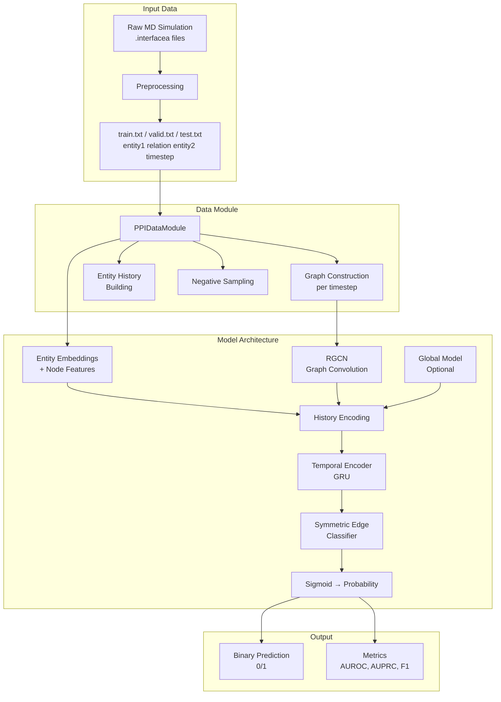
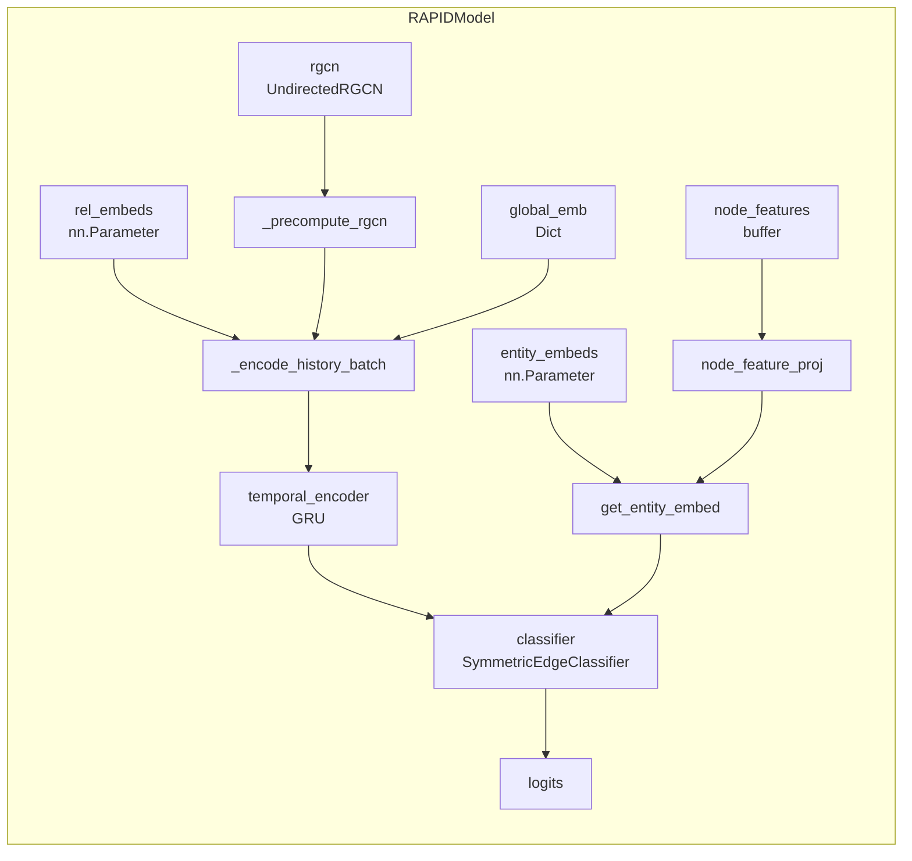
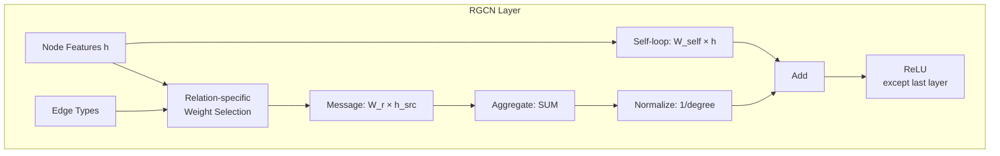
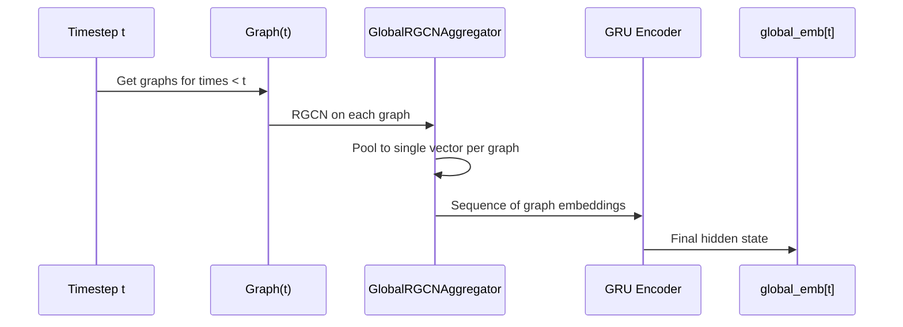
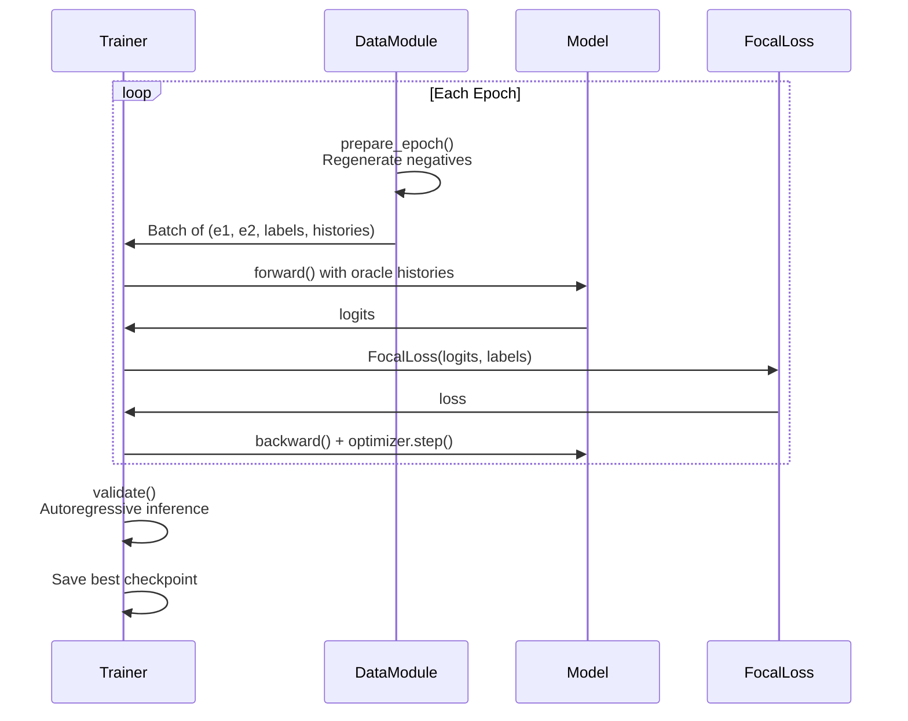

# RAPID Architecture Master Document

## Table of Contents
1. [Executive Summary](#executive-summary)
2. [High-Level Architecture](#high-level-architecture)
3. [Data Pipeline](#data-pipeline)
4. [Model Components Deep Dive](#model-components-deep-dive)
5. [Information Flow Analysis](#information-flow-analysis)
6. [Training & Evaluation](#training--evaluation)
7. [Modification Guide](#modification-guide)

---

## Executive Summary

**RAPID** (Recurrent Architecture for Predicting Protein Interaction Dynamics) is a deep learning model adapted from RE-Net for predicting protein-protein interaction (PPI) dynamics from molecular dynamics (MD) simulations.

### Core Problem
Given a history of protein interactions over time, predict which residue pairs will interact at future timesteps. This is a **binary classification** task on potential edges in a temporal graph.

### Key Design Philosophy
- **Undirected graphs**: Unlike RE-Net which uses directed edges, RAPID treats all protein interactions as symmetric
- **Per-entity history**: Each residue maintains its own temporal interaction history
- **Binary classification**: Instead of entity ranking, directly predict edge existence probability
- **Autoregressive inference**: Predictions at timestep `t` update history for predicting `t+1`

---

## High-Level Architecture



### File Structure Overview

| Directory/File | Purpose |
|---------------|---------|
| `main.py` | CLI entry point, orchestrates all operations |
| `src/models/rapid.py` | Core RAPIDModel class |
| `src/models/global_model.py` | Optional global context model |
| `src/models/rgcn.py` | Relational Graph Convolutional Network |
| `src/models/encoder.py` | GRU temporal encoder |
| `src/models/classifier.py` | Edge classification head |
| `src/data/dataset.py` | PPIDataset, PPIDataModule |
| `src/data/preprocessing.py` | Raw data → RAPID format |
| `src/data/sampler.py` | Hard/easy negative sampling |
| `src/data/node_features.py` | Physicochemical & intrachain features |
| `src/train.py` | Training loop (Trainer class) |
| `src/evaluate.py` | Evaluation logic (Evaluator class) |
| `src/pretrain.py` | Global model pretraining |
| `src/losses/` | Focal loss implementation |
| `src/metrics/` | Classification metrics |

---

## Data Pipeline

### 1. Preprocessing (`src/data/preprocessing.py`)

**Input**: `.interfacea` files from MD simulation analysis
**Output**: `train.txt`, `valid.txt`, `test.txt`, `stat.txt`, `metadata.json`

```
Raw MD Output → discover_interfacea_folder() → read_interfacea_files()
                          ↓
        DataFrame: {chain_a, resid_a, resname_a, chain_b, resid_b, resname_b, frame, type}
                          ↓
            filter_interchain() → Keep only cross-chain interactions
                          ↓
            encode_entities() → Unified integer IDs for all residues
                          ↓
            split_by_time() → Chronological train/valid/test splits
                          ↓
            Output files in RE-Net format
```

**Key Data Format**:
```
# train.txt format: entity1 relation entity2 timestep
42 0 89 0
42 0 89 1
42 0 91 1
...
```

### 2. Dataset Loading (`src/data/dataset.py`)

#### PPIDataset
- Loads quadruples from split files
- Converts to **canonical ordering**: `(min_id, max_id)` for undirected edges
- Groups positive edges by timestep
- Uses `NegativeSampler` for on-the-fly negative generation

#### PPIDataModule
- Manages train/val/test splits
- Builds **graph_dict**: `Dict[timestep, DGLGraph]`
- Builds **entity_history**: Per-entity interaction history
- Provides dataloaders with custom collate function

**Entity History Structure**:
```python
entity_history[entity_id] = [
    {"neighbors": [n1, n2, ...], "rel_types": [r1, r2, ...]},  # timestep t0
    {"neighbors": [n3], "rel_types": [r3]},                     # timestep t1
    ...
]
entity_history_t[entity_id] = [t0, t1, ...]  # corresponding timestamps
```

### 3. Negative Sampling (`src/data/sampler.py`)

**Two types of negatives**:
1. **Hard negatives** (default 50%): Pairs that have interacted before but are OFF now
2. **Easy negatives** (default 50%): Pairs that have never interacted

```python
# Hard pool: ever_positive - current_positive
# Easy pool: all_pairs - ever_positive
```

This creates a balanced challenge: the model must distinguish between:
- Pairs turning OFF (hard) vs pairs that never interact (easy)

### 4. Node Features (`src/data/node_features.py`)

**Optional residue-level features** (8 dimensions total):

| Feature Type | Count | Description |
|-------------|-------|-------------|
| **Physicochemical** | 5 | Hydrophobicity, charge, size, polarity, aromaticity |
| **Intrachain-derived** | 3 | Mean distance to interface, intrachain degree, interface neighbor fraction |

**Key Design**: Intrachain features computed **only from training timesteps** to prevent data leakage.

---

## Model Components Deep Dive

### 1. RAPIDModel (`src/models/rapid.py`)

The central class that orchestrates all components.



**Key Parameters**:
| Parameter | Shape | Purpose |
|-----------|-------|---------|
| `entity_embeds` | `(num_entities, hidden_dim)` | Learnable entity representations |
| `rel_embeds` | `(num_rels, hidden_dim)` | Learnable relation representations |
| `node_features` | `(num_entities, 8)` | Static physicochemical + structural features |

**Critical Methods**:

#### `forward()` - Training Mode
```python
def forward(entity1_ids, entity2_ids, entity1_history, entity2_history, 
            entity1_history_t, entity2_history_t, graph_dict, global_emb):
    """
    Uses ground-truth (oracle) histories for training.
    """
    # 1. Pre-compute RGCN outputs for all needed timesteps
    self._precompute_rgcn(all_timesteps, graph_dict)
    
    # 2. Get entity embeddings (with node features if enabled)
    entity1_embed = self.get_entity_embed(entity1_ids)
    entity2_embed = self.get_entity_embed(entity2_ids)
    
    # 3. Encode temporal history for each entity
    entity1_temporal = self._encode_history_batch(...)
    entity2_temporal = self._encode_history_batch(...)
    
    # 4. Classify edge existence
    logits = self.classifier(entity1_embed, entity2_embed, 
                            entity1_temporal, entity2_temporal)
    return logits
```

#### `predict_batch()` - Inference Mode
```python
def predict_batch(entity1_ids, entity2_ids, timestep, threshold, update_history):
    """
    Autoregressive inference with predicted history updates.
    """
    # Uses internal _entity_history state
    # Predictions are cached and committed to history on timestep transition
```

### 2. UndirectedRGCN (`src/models/rgcn.py`)

**Purpose**: Learn neighborhood-aware entity representations by message passing on interaction graphs.



**Basis Decomposition**:
```python
# Instead of num_rels separate weight matrices:
# W_r = Σ_b coef[r,b] × basis[b]
# This reduces parameters when num_rels is large
relation_weights = einsum("rb,bio->rio", coefficients, basis_weights)
```

**Graph Construction** (`build_undirected_graph()`):
- Adds reverse edges: `(src, dst)` → `(src, dst), (dst, src)`
- Computes symmetric normalization: `1/degree`
- Stores node IDs for embedding lookup

### 3. TemporalEncoder (`src/models/encoder.py`)

**Purpose**: Encode a sequence of historical states into a fixed-size temporal embedding.

```python
class TemporalEncoder(nn.Module):
    """
    Single-layer GRU that processes packed sequences of history embeddings.
    
    Input: PackedSequence of shape (batch, seq_len, 4*hidden_dim)
    Output: Final hidden state of shape (batch, hidden_dim)
    """
```

**Input Composition** (4 × hidden_dim):
1. **RGCN embedding**: Entity's representation in that timestep's graph
2. **Base entity embedding**: Static learned representation
3. **Mean relation embedding**: Average of all relation types
4. **Global embedding**: Graph-level context (if global model enabled)

### 4. SymmetricEdgeClassifier (`src/models/classifier.py`)

**Purpose**: Predict edge existence probability ensuring symmetric scores for undirected edges.

```python
class SymmetricEdgeClassifier(EdgeClassifier):
    def forward(entity1_embed, entity2_embed, entity1_temporal, entity2_temporal):
        # Ensure score(i,j) == score(j,i)
        logits_12 = parent.forward(e1, e2, t1, t2)
        logits_21 = parent.forward(e2, e1, t2, t1)
        return (logits_12 + logits_21) / 2
```

**Input Dimension**: `4 × hidden_dim` (entity1_embed + entity2_embed + temporal1 + temporal2)

**Architecture** (concat scoring):
```
Linear(4*hidden_dim → 128) → ReLU → Dropout
→ Linear(128 → 64) → ReLU → Dropout
→ Linear(64 → 1)
```

### 5. PPIGlobalModel (`src/models/global_model.py`)

**Purpose**: Capture **graph-level** temporal context that enriches per-entity predictions.



**Key Temporal Safety**:
```python
# global_emb[t] is computed from graphs < t+1
# This means when predicting at time t, we can safely use global_emb[t-1]
```

**Pretraining Objective**: Predict entity distribution at next timestep (soft cross-entropy)

---

## Information Flow Analysis

### What Information Is Available at Each Stage

#### Training (Oracle Mode)

| Stage | Information Available | Source |
|-------|----------------------|--------|
| **Entity Embedding** | Learnable parameters + static node features | `entity_embeds`, `node_features` |
| **RGCN (per timestep)** | All edges at timestep t, neighbor interactions | `graph_dict[t]` |
| **History Encoding** | Ground-truth interactions up to t-1 | `entity_history[e]` filtered by `t` |
| **Global Embedding** | Graph-level context from graphs < t | `global_emb[t-1]` |
| **Classification** | Entity pairs with their temporal contexts | All above combined |

#### Inference (Autoregressive Mode)

| Stage | Information Available | Source |
|-------|----------------------|--------|
| **Entity Embedding** | Same as training | Fixed parameters |
| **RGCN** | Training graphs + **predicted** graphs | `_graph_dict` with predictions |
| **History Encoding** | Training history + **predicted** interactions | `_entity_history` with predictions |
| **Global Embedding** | Precomputed + on-the-fly for new timesteps | `_global_emb` or `predict()` |

### Implicit vs Explicit Information

| Type | Examples | How Used |
|------|----------|----------|
| **Explicit** | Entity IDs, relation types, timesteps | Direct input to model |
| **Implicit via Embeddings** | Entity similarity, residue properties | Learned through `entity_embeds` |
| **Implicit via RGCN** | Neighborhood structure, local topology | Message passing aggregation |
| **Implicit via History** | Temporal patterns, persistence | GRU hidden state |
| **Implicit via Global** | System-wide interaction density | Global embedding injection |

---

## Training & Evaluation

### Training Loop (`src/train.py`)



**Key Training Features**:
1. **Focal Loss**: Handles class imbalance by down-weighting easy examples
2. **Gradient Clipping**: Prevents exploding gradients (default: 1.0)
3. **Early Stopping**: Based on validation AUPRC
4. **Threshold Tuning**: Optimal threshold found on validation set

### Evaluation Strategy (`src/evaluate.py`)

**History-Constrained Evaluation**:
```python
# Only evaluate on pairs that have ever interacted
known_pairs = union(train_pairs, val_pairs, test_pairs)
for timestep in test_timesteps:
    for (e1, e2) in known_pairs:
        predict(e1, e2, timestep)
```

This focuses on **dynamics prediction** rather than discovering entirely new interactions.

---

## Modification Guide

### Where to Modify for Different Improvements

#### 1. Improving Temporal Modeling

| What to Change | Where | Notes |
|---------------|-------|-------|
| GRU architecture | `src/models/encoder.py` | Consider Transformer, LSTM |
| History length | `config.seq_len` | Trade-off: context vs. efficiency |
| History content | `_encode_history_batch()` in `rapid.py` | What goes into the sequence |
| Temporal attention | Add to `encoder.py` | Weight recent vs. distant history |

#### 2. Improving Graph Representations

| What to Change | Where | Notes |
|---------------|-------|-------|
| RGCN depth | `config.num_rgcn_layers` | More = larger receptive field |
| RGCN bases | `config.num_bases` | Parameter sharing vs. expressivity |
| Graph structure | `build_undirected_graph()` in `rgcn.py` | Different normalization |
| Pooling for global | `GlobalRGCNAggregator` | mean/max/attention |

#### 3. Improving Classification

| What to Change | Where | Notes |
|---------------|-------|-------|
| Classifier architecture | `src/models/classifier.py` | MLP depth, width |
| Scoring function | `EdgeClassifier.__init__` | concat/bilinear/dot |
| Loss function | `src/losses/__init__.py` | Focal params, alternatives |
| Class weighting | `config.focal_alpha` | Handle imbalance |

#### 4. Improving Data Handling

| What to Change | Where | Notes |
|---------------|-------|-------|
| Negative sampling | `src/data/sampler.py` | Hard ratio, strategies |
| Node features | `src/data/node_features.py` | Add new feature types |
| Train/val/test split | `preprocessing.py` | Different ratios |
| Evaluation pairs | `get_history_pairs_for_timestep()` | All-pairs vs. history-constrained |

#### 5. Combating Persistence Bias

**Problem**: Model may learn to predict "same as yesterday" instead of true dynamics.

**Modification Points**:
| Approach | Where to Modify |
|----------|----------------|
| History masking | `_collate_fn()` in `dataset.py` - randomly mask pair history |
| Curriculum learning | `train.py` - start easy, increase difficulty |
| Focal loss tuning | `config.focal_gamma` - increase for harder examples |
| Different hard ratio | `config.hard_ratio` - more hard negatives |

#### 6. Adding New Components

**Example: Adding Attention Mechanism**:

```python
# 1. Create new module in src/models/
class HistoryAttention(nn.Module):
    def forward(self, history_embeddings, query):
        # Attend over history based on current state
        ...

# 2. Integrate in RAPIDModel._encode_history_batch()
# Replace or augment GRU with attention

# 3. Update forward() call signature if needed

# 4. Add config parameters in src/config.py
```

---

## Quick Reference: Key Data Structures

```python
# Graph Dictionary
graph_dict: Dict[int, DGLGraph]
# graph_dict[timestep].ndata["id"] = node IDs
# graph_dict[timestep].edata["rel_type"] = relation types

# Entity History
entity_history: List[List[Dict]]
# entity_history[entity_id][time_idx] = {
#     "neighbors": [neighbor_ids],
#     "rel_types": [relation_types]
# }

entity_history_t: List[List[int]]
# entity_history_t[entity_id] = [timestep1, timestep2, ...]

# Global Embeddings
global_emb: Dict[int, Tensor]
# global_emb[timestep] = tensor of shape (hidden_dim,)

# Batch from DataLoader
batch = {
    "entity1": LongTensor,       # (batch_size,)
    "entity2": LongTensor,       # (batch_size,)
    "labels": FloatTensor,       # (batch_size,)
    "timesteps": LongTensor,     # (batch_size,)
    "entity1_history": List,     # List of per-entity history dicts
    "entity2_history": List,
    "entity1_history_t": List,   # List of per-entity timestamp lists
    "entity2_history_t": List,
}
```

---

## Configuration Reference

### ModelConfig (`src/config.py`)
```python
@dataclass
class ModelConfig:
    hidden_dim: int = 200         # All embedding dimensions
    num_rgcn_layers: int = 2      # RGCN depth
    num_bases: int = 100          # RGCN basis decomposition
    seq_len: int = 10             # History window size
    classifier_hidden_dim: int = 128
    classifier_dropout: float = 0.2
    dropout: float = 0.2
    node_features: NodeFeatureConfig  # Node feature settings
```

### TrainingConfig
```python
@dataclass
class TrainingConfig:
    learning_rate: float = 1e-3
    weight_decay: float = 1e-5
    grad_clip_norm: float = 1.0
    max_epochs: int = 100
    patience: int = 10            # Early stopping
    focal_gamma: float = 2.0      # Focal loss focusing
    focal_alpha: Optional[float]  # Class weighting
    eval_interval: int = 1
```

### CLI Arguments (main.py)
```bash
# Key training arguments
--hidden_dim 200
--seq_len 10
--lr 1e-3
--epochs 100
--neg_ratio 1.0
--hard_ratio 0.5
--focal_gamma 2.0

# Node features
--disable_node_features
--no_physicochemical
--no_intrachain

# Global model
--use_global_model
--global_model_path ./models/RAPID/global.pth
```
